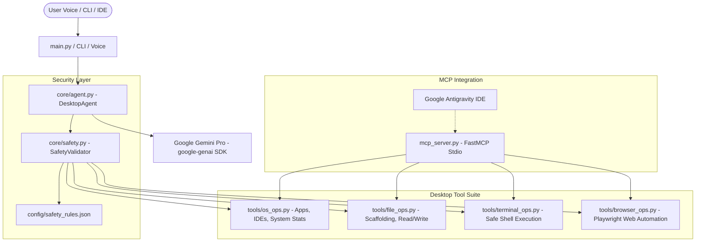

# monaAi - Production-Grade Local Desktop AI Agent

`monaAi` is an autonomous Desktop AI Agent powered by Google Gemini Pro (`google-genai` SDK), engineered with clean architecture, strict typing, and system safety guardrails. It can listen to voice or text commands, scaffold codebases, read/write files, launch VS Code or Antigravity IDE workspaces, execute shell commands with real-time output capture, and automate web tasks with Playwright.

Additionally, `monaAi` includes a native **FastMCP (Model Context Protocol)** server allowing **Google Antigravity IDE** (and other MCP clients) to directly consume and trigger all workstation automation tools.

---

## Architecture Overview



---

## Directory Structure

```
monaAi/
├── config/
│   ├── __init__.py
│   ├── settings.py           # Pydantic v2 BaseSettings (loads .env, models, limits)
│   └── safety_rules.json     # Blacklists, dangerous regexes, protected directories
├── core/
│   ├── __init__.py
│   ├── safety.py             # Multi-tier SecurityValidator & path traversal guard
│   └── agent.py              # Gemini Pro client with autonomous tool dispatch loop
├── tools/
│   ├── __init__.py
│   ├── os_ops.py             # Application launcher, VS Code / Antigravity workspace launcher
│   ├── file_ops.py           # Project scaffolder, file reader/writer, directory inspector
│   ├── terminal_ops.py       # Safe subprocess execution with real-time stdout/stderr capture
│   └── browser_ops.py        # Playwright browser automation (navigation, scrape, screenshot)
├── interfaces/
│   ├── __init__.py
│   ├── voice.py              # Speech-to-Text (speech_recognition) & Text-to-Speech (pyttsx3)
│   └── cli.py                # Rich terminal UI with interactive prompt, tables, and spinners
├── mcp_server.py             # FastMCP server exposing tools to Google Antigravity
├── main.py                   # CLI entrypoint (Text Interactive, Voice, One-shot)
├── requirements.txt          # Production dependencies
├── .env.example              # Configuration template
├── tests/
│   ├── __init__.py
│   └── test_agent_tools.py   # Comprehensive automated test suite
└── README.md                 # Complete documentation & setup instructions
```

---

## Installation & Setup

### 1. Prerequisites
- Python 3.11+
- (Optional for Voice): Linux audio libraries (`sudo apt-get install -y portaudio19-dev espeak python3-pyaudio`)

### 2. Create Virtual Environment & Install Dependencies
```bash
cd /home/mdtajulislam/Projects/monaAi

# Create virtual environment
python3 -m venv venv
source venv/bin/activate

# Install Python packages
pip install --upgrade pip
pip install -r requirements.txt

# Install Playwright browser binaries (Chromium)
playwright install chromium
```

### 3. Configure Environment Variables
Copy `.env.example` to `.env` and configure your API key:
```bash
cp .env.example .env
```

Edit `.env`:
```ini
# Gemini API Key (from https://aistudio.google.com/)
GEMINI_API_KEY=your_gemini_api_key_here

# Default Gemini Model
DEFAULT_MODEL=gemini-2.5-pro

# Safety Enforcement: STRICT, MODERATE, or PERMISSIVE
SAFETY_MODE=STRICT

# Execution timeout
COMMAND_TIMEOUT_SECONDS=60
```

---

## Registering `mcp_server.py` in Google Antigravity

Google Antigravity can connect directly to `monaAi` via the **Model Context Protocol (MCP)** using standard input/output (stdio) transport.

### 1. Locate or Create Antigravity MCP Config
Open or create `~/.gemini/config/mcp_config.json`:

```bash
mkdir -p ~/.gemini/config
nano ~/.gemini/config/mcp_config.json
```

### 2. Add `mona-desktop-agent` Server Entry
Add the following configuration (replace paths with your actual project directory and virtual environment):

```json
{
  "mcpServers": {
    "mona-desktop-agent": {
      "command": "/home/mdtajulislam/Projects/monaAi/venv/bin/python",
      "args": ["/home/mdtajulislam/Projects/monaAi/mcp_server.py"],
      "env": {
        "GEMINI_API_KEY": "your_gemini_api_key_here",
        "WORKSPACE_ROOT": "/home/mdtajulislam/Projects/monaAi",
        "PYTHONPATH": "/home/mdtajulislam/Projects/monaAi"
      }
    }
  }
}
```

### 3. Verify in Antigravity IDE
1. Open Antigravity IDE.
2. Navigate to **Additional Options (...) > MCP Servers**.
3. You will see `mona-desktop-agent` connected with all 13 tools active:
   - `execute_command`
   - `open_application`
   - `launch_ide`
   - `get_system_stats`
   - `kill_process`
   - `create_project_structure`
   - `read_file`
   - `write_file`
   - `list_dir`
   - `open_url`
   - `take_screenshot`
   - `extract_page_content`
   - `search_web`

---

## Usage

### 1. Desktop Voice & Text Web UI (Hands-Free "Hey Mona")
Launch the interactive web UI with real-time wake word and speech recognition:
```bash
./run.sh
# or
python main.py --ui
```
This automatically opens **`http://127.0.0.1:8765`** in your default browser:
- 🎙️ **Wake Word ("Hey Mona" / "হে মোনা")**: You can simply say **"Hey Mona"** hands-free to wake up the agent, followed by your command (e.g. *"Hey Mona, amar pc-te ekta Python file banao"* or *"হেই মোনা, মেমোরি চেক করো"*).
- 🇧🇩 **বাংলা ভাষা সাপোর্ট (Bengali Language)**: Agent understands Bengali and Banglish commands and naturally responds in polite Bengali.
- 🔊 **Bengali Voice (TTS)**: The agent speaks its answers back out loud in Bengali.
- 💬 **Text & Voice Dual Input**: Speak hands-free or type commands directly into the input dock.
- ⚡ **Live Tool Execution**: Real-time cards showing shell commands, file modifications, and browser tasks as they happen.

### 2. Interactive CLI Mode
If you prefer running inside a terminal:
```bash
./run.sh --cli
# or
python main.py --cli
```

### 2. Voice-Interactive Mode
Start in voice listening mode with speech synthesis:
```bash
python main.py --voice
```
You can also toggle voice mode on the fly during an interactive session by typing `voice`.

### 3. One-Shot Command Execution
Execute a command directly from the shell or desktop shortcut:
```bash
python main.py -p "Inspect the git status of this repository and report any untracked files"
```

### 4. Running the MCP Server Manually
To test or run the MCP server over stdio:
```bash
python mcp_server.py
# or
python main.py --mcp
```

---

## Safety & Security Architecture

The agent executes actions through `core/safety.py`, which validates every command and path against `config/safety_rules.json`:

1. **Forbidden Shell Commands & Patterns**:
   - Outright blocks commands such as `rm -rf /`, `rm -rf ~`, `mkfs`, `format c:`, `dd if=`, fork bombs, device writes (`> /dev/sda`), and permissions wipes (`chmod -R 777 /`).
2. **Protected System Directories**:
   - File writes and path resolution block traversal into root and OS system directories (`/etc`, `/boot`, `/sys`, `/proc`, `C:\Windows`, etc.).
3. **Safety Modes**:
   - `STRICT`: Blocks forbidden commands, blocks dangerous patterns, and enforces confirmation on destructive Git/Docker actions.
   - `MODERATE`: Standard developer protection with warnings.
   - `PERMISSIVE`: Allows advanced administration while still catching catastrophic commands.

---

## Running the Verification Suite

Run all automated unit tests:
```bash
pytest -v tests/
```
# monaAi
